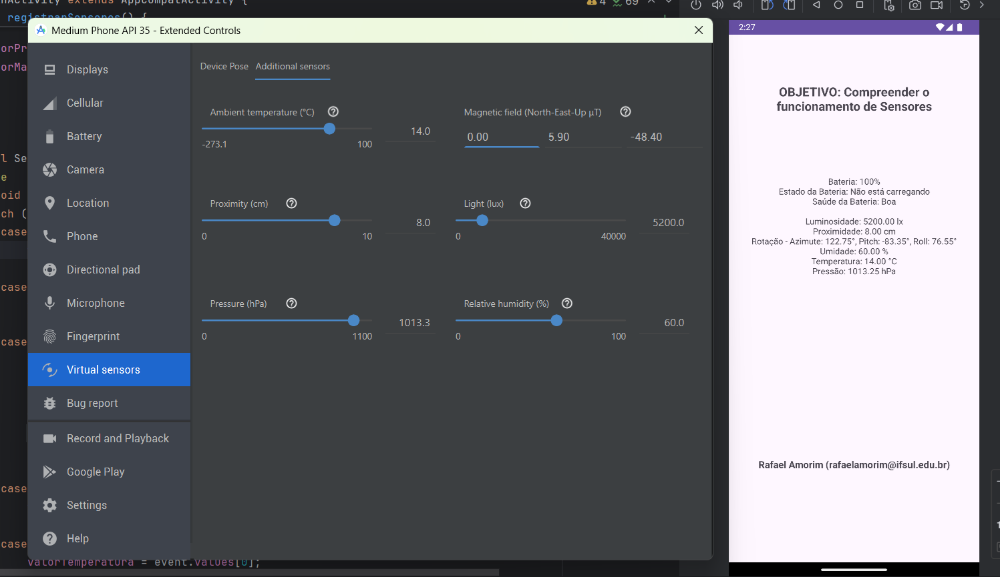

    

# Exemplo de uso de sensores

Repositório criado para mostrar uma aplicação simples usando [sensores](https://developer.android.com/develop/sensors-and-location/sensors/sensors_overview?hl=pt-br) 
na disciplina de Desenvolvimento Mobile II, do curso de Tecnólogo em Analise e Desenvolvimento de Sistemas do
Instituto Federal Sul Riograndense (IFSul), [Campus Santana do Livramento](http://www.santana.ifsul.edu.br/).

## Screenshot

    

